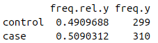
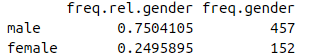
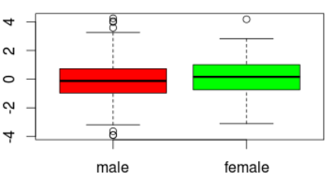
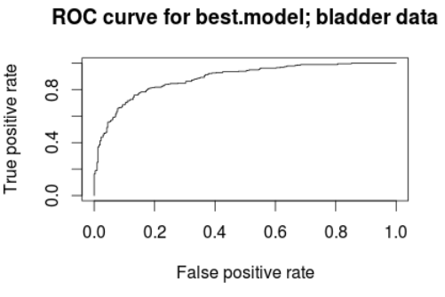
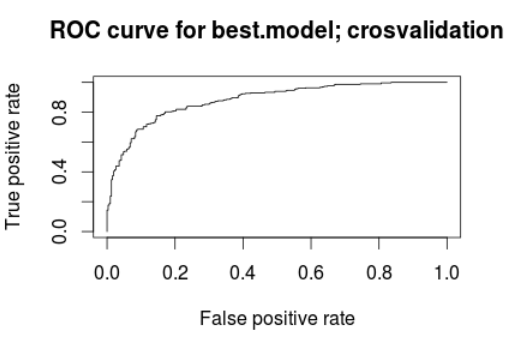
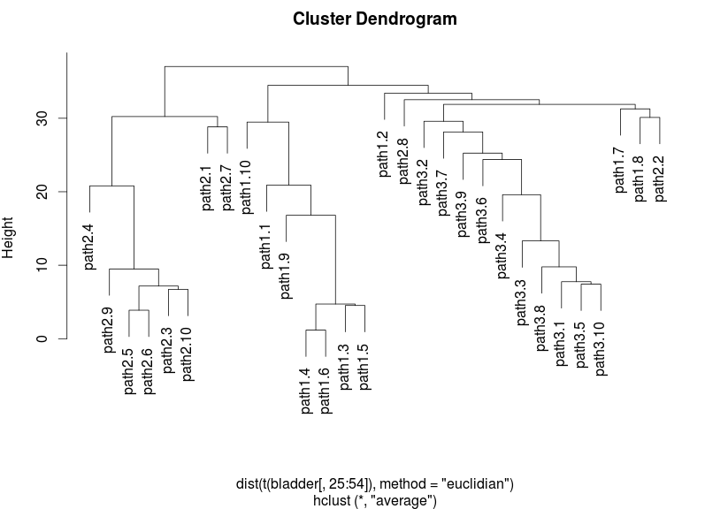
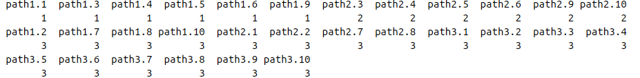

# Álvaro Ponce Cabrera

## Questions:

1. *Convert variables &quot;y&quot; and &quot;gender&quot; to factor variables.*
2. *Define the labels for variables &quot;y&quot; and &quot;gender&quot;.*

	Using factor() function with the argument labels() the variables are created as we can see in the script.

3. *Build a frequency table for &quot;y&quot; that contains, both, the absolute and the relative frequencies. The same for &quot;gender&quot;*

	Absolute frequency tables are created using table() and relative frequencies tables are created with prop.table() function which the frequency table as argument.

	The last table which contains both, absolute and relative frequency tables, is created with table()

	These are the results:

 	   	

4.  *Plot gene1 levels as a function of &quot;gender&quot;.*

	

5. *Test the normality of the expression levels of the 20 genes (use function apply). How many genes are not normally distributed and which are these genes?*

	The normality of some data is obtained by the function shapiro.test().

	Shapiro.test() is a test which H0 said that our data are normally distributed.

	Doing this, we obtain that only gene15 and gene3 are not normally distributed.

6. *Test whether mean expression levels of gene1 and gene2 are equal. Note: this is a test for equality of means with paired samples. This test is performed by computing the difference of the two variables (gene1-gene2) and testing whether the mean of the difference is equal to zero.*
	
	A T-test is necessary to do it, so we use t.test() function which null hypothesis is the mean of gene1 and gene2 are equal.

	Gene1 and gene2 are paired samples from the same dataset, so we used test for the equality of two means with paired samples.

	We computed the t.test() of d= gene1-gene2 and we obtained a p-value equal to 0,16.
	Then we do not reject the null hypothesis.

7. *Test if the mean expression levels of gene1 are equal between cases and controls.*

	To test if the mean expressions levels of 2 variables are equal we need to compute a t.test(), but first, it is necessary to compute a var.test() in order to verify if the variances of this 2 variables are equal or not.

	If variances are not equal we add the argument var.equal=F to t.test() function.

	In our case variances are no equal, and our t.test give us a p-value equal to 0,094, so we do not reject the null hypothesis (the null hypothesis is that the mean of the variables are equal).

8. *Obtain a 95% bootstrap confidence interval for the 20th percentile of gene1.*

	To do this we used boot() function which receive a statistic as a function as Its second argument, so we did it before run boot().

	After that, we generated the 95% confidence interval with boot.ci() and we obtained that this interval is equal to (-1.295 , -1). It means that with a 95% of probability our 20th percentile will be inside this interval.

	Actually in this case we can check that it's true by running our statistic function over our data, and we obtain that our 20th percentile is in the value -1.6564, which is inside the interval.

9. *Contrast using a permutation test whether the 20th percentile of gene1 for male and female are equal.*

	To do a permutation test we need to obtain:

	First: the observed data (Sobs). In this exercise Sobs=q1-q2.  And q1=20th percentile of gene1 for male, and the other one is for female.

	Second: the null hypothesis distribution which we are going to do the test. It will be used as our H0, if our (Sobs) are in the 0,05% of data range we will reject H0.

	Just to be clear, our H0 is that q1-q2=0, I mean, that q1 are equal to q2.

	So we compute in absolute value for the % of values that are bigger than our Sobs.

	(Absolute value is important in order to not ignore values smaller than our Sobs in the null distribution).

	In our case p-value=0,041, and we can reject H0.

	q1 is not equal to q2.
	
10. *Perform a nonparametric test for association of gender and the risk of disease. Provide the OR (change the levels of &quot;gender&quot; if necessary in order that the given OR is larger than 1)*

	To calculate odds ratio we used the oddsratio() function, that receive a table with case/control data vs gender data.

	We need to be sure that we are comparing cases vs controls and not controls vs cases, also, the value obtained was less than 1, so the order of males/females were changed too

	Finally oddsratio is equal to 1,26 in male vs female, I mean, males can suffer the disease 1,26 more times that females. However, the p-value is not significant, so we cannot accept this oddsratio as certain.

11. *Explore for possible relationship between methylation and gene expression.*

	In this exercise we need to compute the cor.test() function using each gene as first argument and methyl as the second one. Also, we must include one more argument specifying the method of the correlation test, that would be &quot;spearman&quot; because methyl is not normally distributed.
	
	The test give us 2 importants values, rho and p-value. P-value indicates the signification of the relationship and rho indicates the grade of this relation.

	In this case only gene16 and gene4 have significant p-values, so we will only see the grade of the relation between this genes and methil.

	Geene16 has a rho=0,08, it indicates a low relation between gene16 and methyl.

	In contrast, gene4 has a rho=0,07, and it indicates a high relation between gene4 and methyl.

12. *Identify genes that are related to the risk of bladder cancer using a multivariate logistic regression model with stepwise variable selection. Denote the selected model as &quot;best.model&quot;. Interpret the obtained model.*

	It was generated a logistic regression model using all the genes variables as X and the variable y as Y with the glm() function.

	Then, it was calculated the best model with the function step() which calculate the model with the lowest AIC eliminating variables and checking the AIC in each step.

	The genes given by step() were used in the creation of the new model called best.model as we can see in the script.

	The genes used were: gene7+gene11+gene15+gene16+gene19.

13. *Analyze the classification ability of &quot;best.model&quot; (ROC curve and AUC) according to the following schemes:*
  
  	13.1. *Apparent validation of &quot;best.model&quot; using the same data that was used for model building.*

 	

	13.2. *Crosvalidation with k = 5 for &quot;best.model&quot;.*

	Just like the &quot;a&quot; section a ROC curve was generated, but in this case crosvaldation method has been used.

 	

	13.3. *Explain why both the &quot;a&quot; and &quot;b&quot; overestimate the classification accuracy of &quot;best.model&quot;. Suggest a scheme for determining an unbiased estimate of the classification accuracy of &quot;best.model&quot;.*

	Both validations overestimate the classification accuracy of &quot;best.model&quot; because they use the same data for build the model and test it.

	To obtain a better validation we need our training being different to the test data, I mean, we need a external validation.

14. *For each variable &quot;genei&quot;, i=1, …, 20, define a new factor variable &quot;levels.genei&quot; with values &quot;high&quot; if gene levels are positive or zero and &quot;low&quot; if gene levels are negative.*

	An apply() function was done over the genes of bladder defining each gene variable as a new factor variable and loaded in a variable with class equal to matrix.

	For this reason this variable was created again as a data.frame.

	Finally the names of the new factor variables was changed from &quot;genei&quot; to &quot;levels.genei&quot; using gsub() function.

	Then, we have all our new variables saved in a data frame.

	I know that I could save all the new factor variables in the global environment as independent variables called just &quot;levels.genei&quot;, but I preferred to save the variables in the local environment of a data frame because I consider that in this case the variables are easier to work with staying in a data frame, because we can use apply() function over a data frame or get the variable what we want attaching the data frame with attach().

15. *Perform a nonpametric test of association between each variable &quot;levels.genei&quot; and the risk of disease. Adjust the p-values for multiple testing according to an fdr threshold equal to 0.1. Interpret the results.*

	Chi-squared test perform a test of the association between two categorical variables.

	The null hypothesis is that the variables are independent, and H1 is that the variables are related.

	Chisq.test() function was applied over each levesl.gene variable.

	Then, a vector with the p-values of this test was obtained in order to use it for the p-value adjust.

	As a result, levels.gene 5, 6, 10, and 14 have a p.value&lt;0.1 and reject H0, this levels.gene  are related with the risk of disease.

16. *Using the last 30 variables corresponding to gene expression levels in three different pathways, perform a clustering analysis (hierarchical and k-means) and explore groups of genes that have similar expression. Explain the results.*

	In the hierarchical clustering analysis a plot by the transposition of our data was  done using hclust() function.
	
	
	
	As we can see, it seems that there are 2 principals clusters.

	The first one has path2.i pathways inside, and is divide in 2 clusters.

	The second one has 2 big clusters, one with path3.i pathways and other with path1.i pathways.

	Actually we can also see some path1.i or 2.i inside the path3.i cluster and a few of them (path1.7, path1.8 and path2.2) in a cluster far from the path1 and path2 cluster.

	Finally we should mention too some path1.i and path2.i that are far from their original clusters.

	So, although we have some strange cases, we can be sure that path1.i, path2.i and path3.i are related between themselves, because we observed clearly 3 mains clusters for each pathway type (path1, 2, or 3). In addition we can say that path1.i and path3.i are more related between them than between path2.i.

	We would need more data to give an explication of this estrange path cases that are related with other pathways.

	About kmeans, we create using kmeans() function other way to see the relationship between the pathways by coercing the data to be distributed in just k clusters, in this case, 3.

	

	Again we can clearly see 3 different clusters, one for path1.i, other for path.2.i and the last one for path3.i, although we have some cases in cluster 3 from path2.i and path1.i, but It was expected after explaining the hierarchical method.